# Lumbar Spine Degenerative Classification Using YOLO v8 and DeepScoreNet
 
This repository focuses on developing models for the detection and classification of degenerative spine conditions using lumbar spine MR images.

he aim is to simulate a radiologist's diagnostic process, helping to identify and assess the severity of conditions such as neural foraminal narrowing, subarticular stenosis, and spinal canal stenosis. This project is part of a competition to build models that enhance the accuracy and efficiency of diagnosing these spine conditions

This repository is for solving the kaggle competition and the link of this competition is : 

[RSNA 2024 Lumbar Spine Degenerative Classification](https://www.kaggle.com/competitions/rsna-2024-lumbar-spine-degenerative-classification/overview)

You can download the dataset from the link above.

# Data Description 

As explained above the aim of this challenge is that to classify the lumbar degenerative spine codition.
Based on the overview of this challenge we have 5 lumbar spine degenerative:

- Right Neural Foraminal Narrowing
- Left Neural Foraminal Narrowing
- Left Subarticular Stenosis
- Right Subarticular Stenosis
- Spinal Canal Stenosis

This codition can ocure across 5 intervertebral disc level:

- L1/L2
- L2/L3 
- L3/L4 
- L4/L5
- L5/S1

for this condition we want to predict severity scores and the score are : 

- Normal/Mild
- Moderate
- Severe

This dataset collected from different sources and we different modalities and view, there are 3 view and modalities:

- Sagittal T1
- Sagittal T2
- Axial T2 

Based on this dataset for each view and modalities we have a specifict condition:

- Neural Foraminal Narrowing: Sagittal T1

- Spinal Canal Stenosis: Sagittal T2

- Subarticular Stenosis: Axial T2 

In this dataset, we have a csv file that explain the severity scores, the modalities of data, and the train labels coordination (x,y).
All this description are in 3 different csv files.

# Approach for Training and Evaluation

For training and evaluation of this dataset, there are several possible approaches. I want to explain the approach I plan to develop.

First, I aim to develop a detection model. When classifying the entire image, much of the data is irrelevant and doesn't contribute to model training. Therefore, the first step is to develop a detection model that identifies and draws a bounding box around the specific part of the image we want to classify.

To achieve this, I will use the YOLO v8 pre-trained model as the detection model. (I will explain more details in the following sections of the README.)

In the second step, I will develop a new classifier model to train exclusively on the specific part of the image defined by the bounding box.

Overall Process of the Model
The model will follow a sequential approach:

Detection: Identify the region of interest (ROI) in the first step and extract that part from the entire image.
Classification: Pass the extracted ROI through the classifier model to predict the severity score

# Data Cleaninig

First of all, we are working with the train_label_coordinates.csv file which is includes :

- study_id
- series_id
- instance_number
- condition
- level
- x,y

Because we only want to train and work with the part of image that we have a coordintation (The box).

In this part we add also the other information that available for this dataset and to this csv file and 
create and save new csv file. The data that we want to add to this csv file are:

- series_description (from: train_series_descriptions.csv file)

- severity score (from: train.csv file)

The code for this purpose are available in directory [Data_Cleaning](./Data_cleaning/)directory.

> [!IMPORTANT]
> You need to put the data (all the folders and csv file) in the main directory of this repository.

The output is the csv file named:

 dataset_description.csv

 the columns are : 

 - study_id
 - series_id
 - instance_number
 - condition
 - level
 - x
 - y
 - series_description
 - score

# Data condition Spliting

After the previous part that we create a single csv file that includes all the data that we want to use it, 
now we want to splitted this data to seperated csv file for each condition. (The left and right condition are in same group)

At the final we have three csv file:

- Neural_Foraminal_Narrowing.csv
- Subarticular_Stenosis.csv 
- Spinal_Canal_Stenosis.csv

The code for this purpose are available in directory [Data_Condition_Splitting](./Data_splitting/)directory.

# Condition Detector Model

One of the most popular models for segmentation and detection is YOLO, which is trained on large datasets and is known for its speed.

For each condition, we develop this model separately, and for each condition, we have a different number of output classes.

[!IMPORTANT]
We train the model for each condition separately, effectively separating the view and condition, because for each condition, we use the same view and modality.

The models we are going to train, along with the number of output classes for each, are as follows:

|           Condition            |           Number of Output       |    
| -------------------------------| -------------------------------- |
|   Neural Foraminal Narrowing   | 2(left/right) * 5(Disc level)= 10| 
|     Spinal Canal Stenosis      |       1 * 5(Disc level)= 5       |
|     Subarticular Stenosis      | 2(left/right) * 5(Disc level)= 10|

> [!IMPORTANT]
> We can also add the score severity in number of class, but we want to the model consentrate in this classis and use other model for classifing the severity.

### Condition Detector Model (cross-validation,preparing data, training)

For training and evaluation model, the various cross-validation approach developed. For this dataset, we 
develop k-fold cross-validation. The fold seperated based on the classes (condition + level)

After we splitted the data based on the k-fold, we want to prepare data for training.
For preparing the data for YOLO v.8 the data should be in this structure:

datasets/
│
├── train/
│   ├── images/
│   │   ├── image1.png
│   │   ├── image2.png
│   │   └── ...
│   └── labels/
│       ├── image1.txt
│       ├── image2.txt
│       └── ...
│
├── val/
│   ├── images/
│   │   ├── image1.png
│   │   ├── image2.png
│   │   └── ...
│   └── labels/
│       ├── image1.txt
│       ├── image2.txt
│       └── ...
│
└── yolo_config.yaml

we convert the dcm to png with normalization, and we calculate the label for each image and save it as .txt format.

The format of label should be :

class_id center_x center_y width height

### Cross-validation

for cross-validation, we read each condition csv file and based on the classed that is condition+level, we seperated the data to K-fold. the k here is 5.

For each condition the single csv file will create and added two column : calss_id and folds.

> [!IMPORTANT]
> The model that we want to use is YOLO version 8.0. 

> [!IMPORTANT]
> The width of bax is 16.

The code for this purpose are available in directory [Detector_Model](./Detector_data/)directory.

## K-Fold Cross-Validation Results (YOLO v8) for Neural Foraminal Narrowing

### Fold 0 

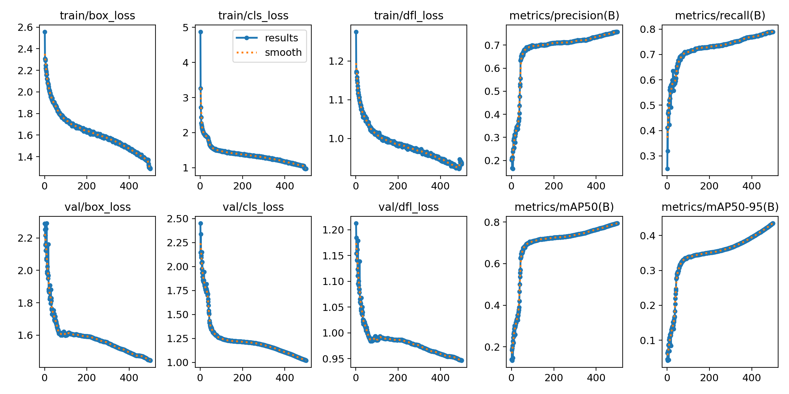

### Fold 1

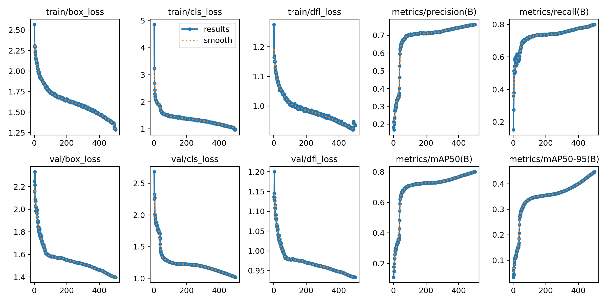

### Fold 2

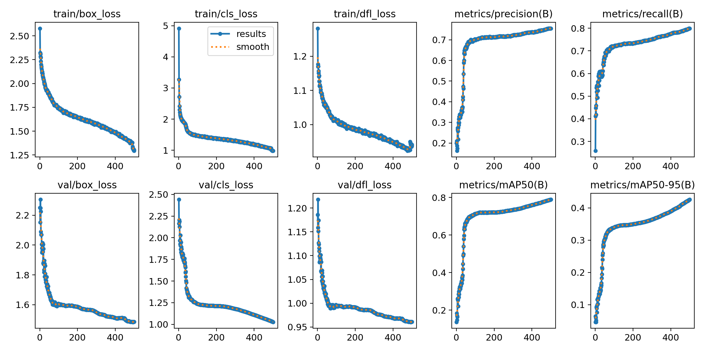

### Fold 3 

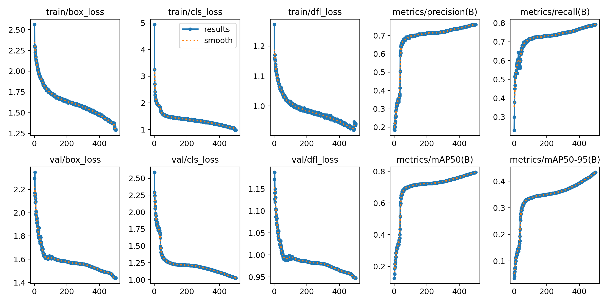

### Fold 4

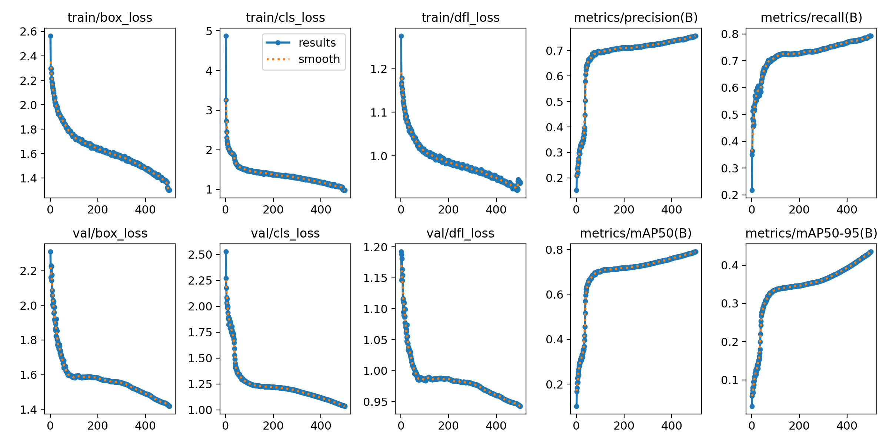

## K-Fold Cross-Validation Results (YOLO v8) for Spinal Canal Stenosis

### Fold 0 

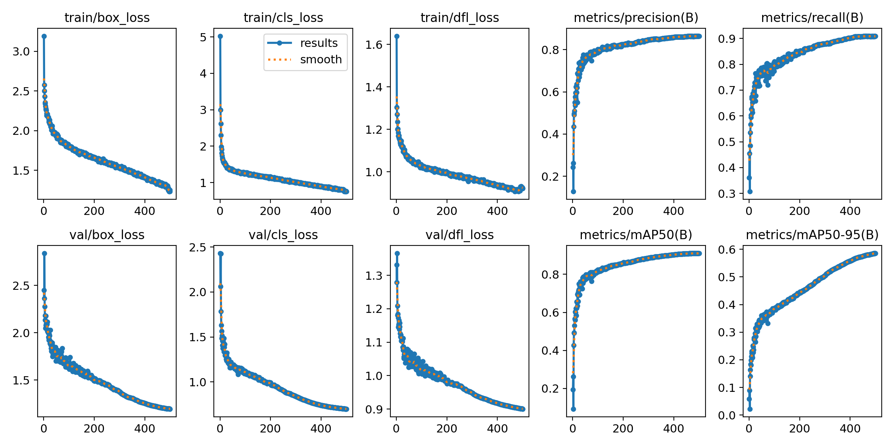

### Fold 1 

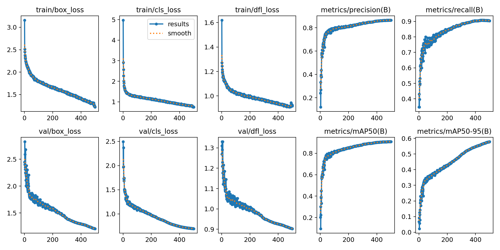

### Fold 2 

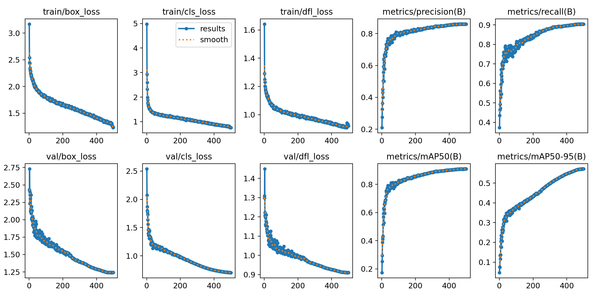

### Fold 3 

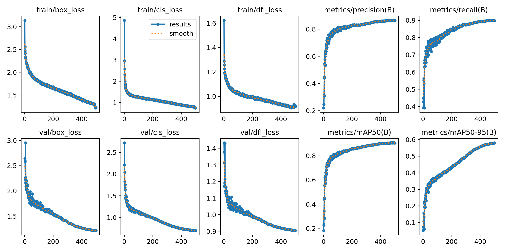

### Fold 4

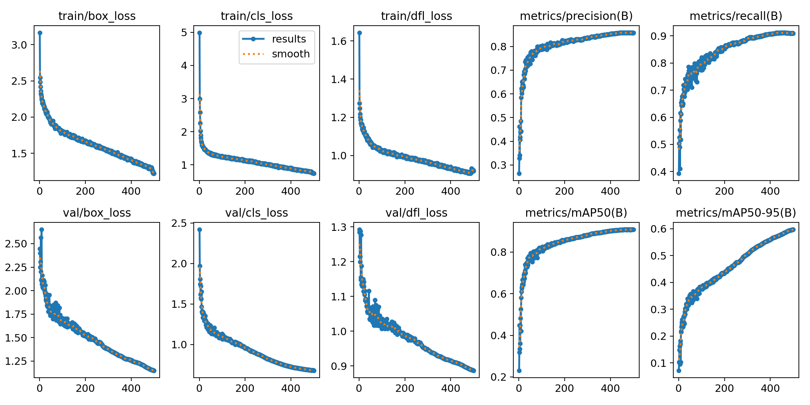

## K-Fold Cross-Validation Results (YOLO v8) for Subarticular Stenosis

### Fold 0 

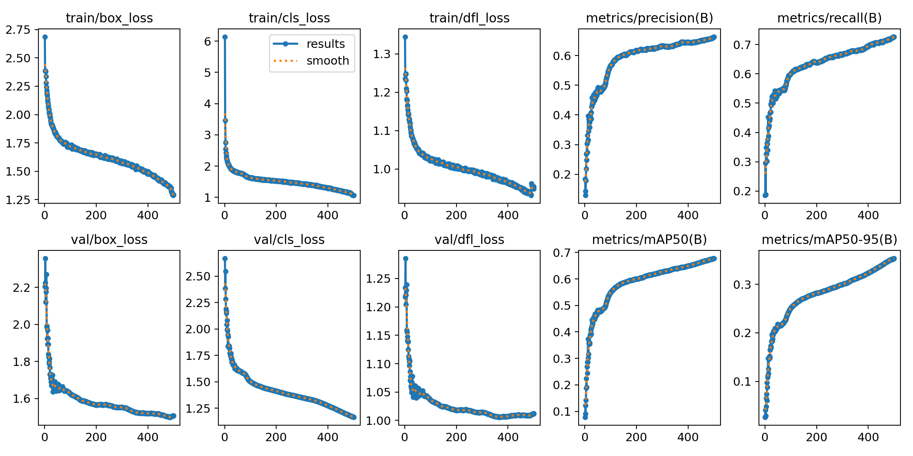

### Fold 1 

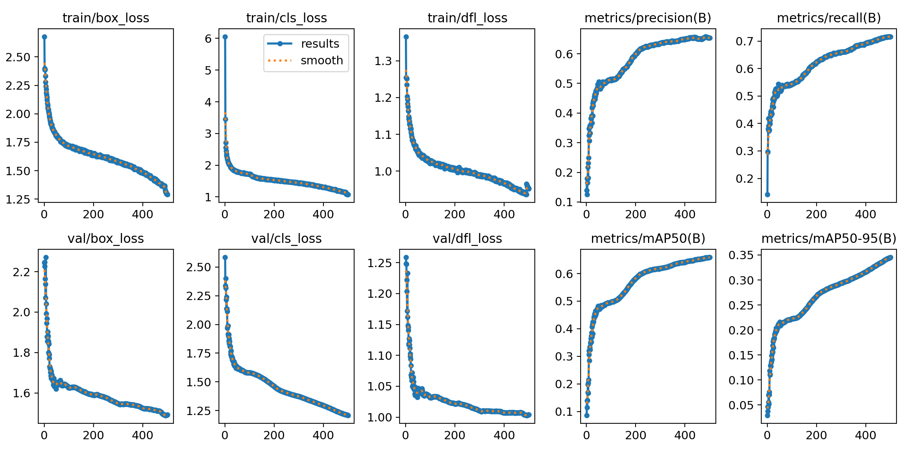

### Fold 2 

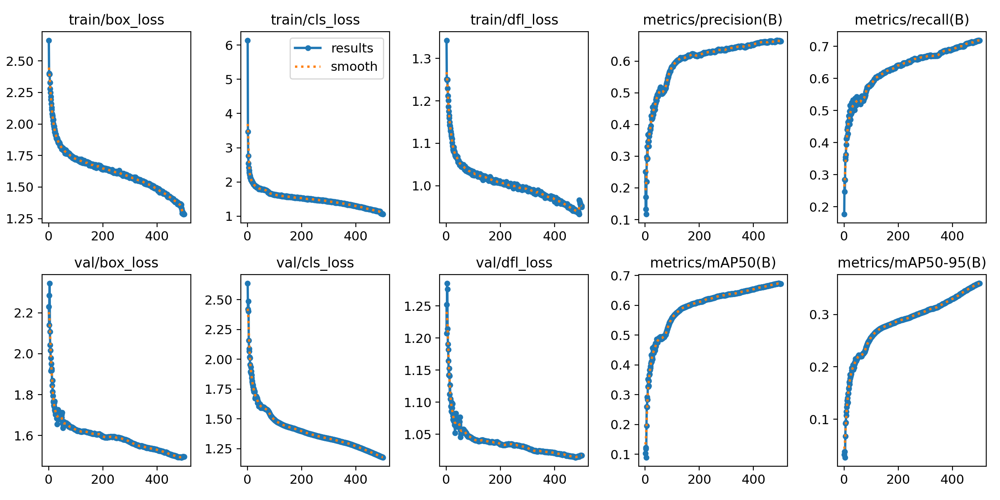

### Fold 3 

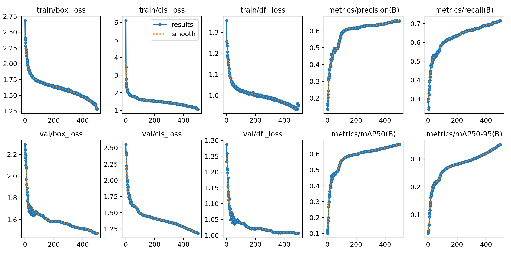

### Fold 4

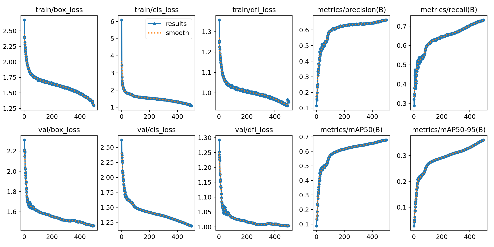

# Score Classifier Model

For the classifier model, we plan to use the DeepScoreNet model for classification.

Similar to the detector model, we will develop three separate models, one for each condition. (Note that left and right sides are treated as part of the same condition and model.)

## Score Model-DeepScoreNet (Data augmentation, data prepration , training)

In the previous section, we developed the YOLO v8 model for classifying conditions. In this section, we focus on developing another classifier for predicting the severity score (Normal, Moderate, Severe).

For this purpose, we implemented a DeepScoreNet model.

Additionally, due to the imbalance in the number of samples across the classes, we explored two approaches:

1. Data augmentation
2. A custom loss function based on class distribution

## Data Augmentation

Data augmentation is one approach to handling class imbalance. However, the challenge here is that excessive data augmentation can lead to overfitting. In this dataset, the class imbalance is severe for each condition. If we apply too much data augmentation, the model may overfit.

To address this, we approached the imbalance as follows: We have three classes—one majority class and two minority classes. Our strategy is to augment the first minority class until it reaches one-third(1/3) of the size of the majority class, and augment the second minority class until it reaches half(1/2) the size of the majority class.

We then applied a custom loss function designed to account for the class distribution.

## Cross_validation

For cross-validation, we split the data into k-folds. In each fold, the split was done based on the dataset distribution, meaning that in the first step, we divided the data into k-folds where each fold maintained the same class distribution as the total dataset for that condition. Data augmentation was then applied to the training folds, but not to the evaluation fold. This ensures that the evaluation data remains untouched by augmentation.

## data prepration

 in this part, we read each csv file and convert all the row to png format and if there is any data augmentation approach we also apply that augmentation approach for that subjects. 

The code for this purpose are available in directory [Score_Model](./Detector_data/)directory.

## K-Fold Cross-Validation Results for 0/88

During the training of the model, we used **K-Fold Cross-Validation** to evaluate performance across multiple subsets of the data. Below are the evaluation metrics for each fold:

| Fold  | Accuracy  | Precision | Recall    | F1 Score  |
|-------|-----------|-----------|-----------|-----------|
| Fold 0| 0.7801    | 0.8346    | 0.7801    | 0.7984    |
| Fold 1| 0.7852    | 0.8385    | 0.7852    | 0.8018    |
| Fold 2| 0.8121    | 0.8208    | 0.8121    | 0.8161    |
| Fold 3| 0.7976    | 0.8292    | 0.7976    | 0.8096    |
| Fold 4| 0.7978    | 0.8310    | 0.7978    | 0.8105    |

### Best Performing Fold

Based on the results, **Fold 2** is selected as the best-performing model. Here's why:

- **Highest Accuracy:** Fold 2 achieved the highest accuracy of **0.8121**, indicating it correctly classified the most samples overall.
- **Best F1 Score:** Fold 2 also has the highest F1 Score of **0.8161**, which is a balance between precision and recall, making it a strong candidate for tasks where both false positives and false negatives are of concern.
- **Balanced Performance:** While Fold 1 had a slightly higher precision, Fold 2’s overall balance across accuracy, precision, recall, and F1 score makes it the most reliable fold for the final model selection.

This model will be used for further evaluation and deployment due to its superior performance.

## K-Fold Cross-Validation Results for Spinal Canal Stenosis

During the training of this model, we used **K-Fold Cross-Validation** to evaluate performance across multiple subsets of the data. Below are the evaluation metrics for each fold:

| Fold  | Accuracy  | Precision | Recall    | F1 Score  |
|-------|-----------|-----------|-----------|-----------|
| Fold 0| 0.8954    | 0.9065    | 0.8954    | 0.9002    |
| Fold 1| 0.8288    | 0.9083    | 0.8288    | 0.8586    |
| Fold 2| 0.8683    | 0.9062    | 0.8683    | 0.8837    |
| Fold 3| 0.8928    | 0.9098    | 0.8928    | 0.8997    |
| Fold 4| 0.8995    | 0.9120    | 0.8995    | 0.9051    |

### Best Performing Fold

Based on the results, **Fold 4** is selected as the best-performing model. Here's why:

- **Highest Accuracy:** Fold 4 achieved the highest accuracy of **0.8995**, indicating it correctly classified the most samples.
- **Best F1 Score:** Fold 4 also has the highest F1 Score of **0.9051**, which shows its balance between precision and recall.
- **Highest Precision:** Fold 4 also achieved the highest precision of **0.9120**, meaning it minimizes false positives.

This fold demonstrates superior performance across all key metrics, making it the best candidate for further evaluation and potential deployment.

## K-Fold Cross-Validation Results for Subarticular Stenosis

We used **K-Fold Cross-Validation** to evaluate the performance of this model across multiple data subsets. Below are the evaluation metrics for each fold:

| Fold  | Accuracy  | Precision | Recall    | F1 Score  |
|-------|-----------|-----------|-----------|-----------|
| Fold 0| 0.7903    | 0.8212    | 0.7903    | 0.8017    |
| Fold 1| 0.7494    | 0.8132    | 0.7494    | 0.7700    |
| Fold 2| 0.7931    | 0.8199    | 0.7931    | 0.8034    |
| Fold 3| 0.7164    | 0.8205    | 0.7164    | 0.7447    |
| Fold 4| 0.7205    | 0.8085    | 0.7205    | 0.7468    |

### Best Performing Fold

Based on the results, **Fold 2** is selected as the best-performing fold. Here's why:

- **Highest Accuracy:** Fold 2 achieved the highest accuracy of **0.7931**, indicating that it correctly classified the most samples overall.
- **Best F1 Score:** Fold 2 also had the best F1 Score of **0.8034**, providing a balance between precision and recall.
- **Balanced Precision and Recall:** Fold 2 has a strong balance between **precision (0.8199)** and **recall (0.7931)**, making it reliable for both minimizing false positives and maximizing correct classifications.

This fold will be used for further evaluation and potential deployment due to its overall balanced and superior performance.

## Predictor model 

In this part we combine both model (Condition Detector Model and score model ) as a single model 
and create a pipline for read the test data that is available in this dataset and return the csv file as a results.

for each model, we choose the best model that performe across all the cross validation training.

